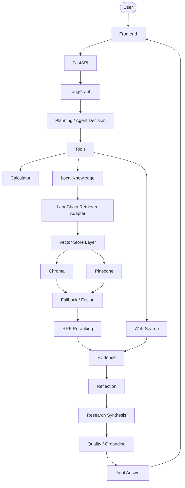

# AI Research Agent

The AI Research Agent is an advanced, agentic research system designed to autonomously retrieve, synthesize, and validate information across multiple sources. Built upon a custom orchestration layer migrated to **LangGraph**, it integrates carefully selected **LangChain Core** abstractions while maintaining robust proprietary implementations for Retrieval-Augmented Generation (RAG). The agent leverages vector retrieval, multi-source research capabilities (local knowledge and web search), rigorous evidence reflection, and strict citation grounding validation. It features conversation memory, seamless provider fallback between LLMs, a FastAPI backend, and an intuitive web UI for real-time interaction.

## Features

- Agentic tool selection
- Local RAG
- Chroma vector database
- Pinecone-compatible backend
- Retrieval fallback
- Multi-retriever fusion
- Reciprocal Rank Fusion
- Web search
- Calculator
- Reflection
- Research planning
- Multi-source evidence synthesis
- Claim grounding
- Citation validation
- Conversation memory
- Gemini/OpenRouter provider fallback
- LangGraph orchestration
- LangChain Core abstractions
- FastAPI API
- Web UI
- Observability/tracing
- Offline evaluation suite

## Architecture Diagram



## Technology Decision Table

| Technology | Purpose | Why |
|------------|---------|-----|
| Python | Core application | Standard ecosystem for AI/ML and data manipulation. |
| LangGraph | Agent orchestration | Provides deterministic cyclic state management without opaque wrappers. |
| LangChain Core | Standard abstractions | Selected precisely for Document and ChatPromptTemplate standard structures. |
| Chroma | Local vector DB | Easy in-memory or localized flat-file embeddings storage with zero infrastructure. |
| Pinecone | Cloud vector DB option | Provides a scalable, robust, and managed remote fallback mechanism. |
| Gemini | Primary LLM | High-performance, fast model generation selected as the baseline model. |
| OpenRouter | Provider fallback | Acts as the automated failover endpoint when the primary LLM faces rate limits. |
| FastAPI | API layer | Fast, asynchronous web framework exposing robust REST endpoints. |

## Project Structure

```text
project/
├── agent.py
├── api_server.py
├── config.py
├── graph.py
├── langchain_integration.py
├── llm.py
├── main.py
├── memory.py
├── planning.py
├── quality.py
├── reflection.py
├── requirements.txt
├── research.py
├── state.py
├── tools.py
├── api/
├── docs/
├── evaluation/
├── frontend/
├── providers/
└── rag/
```

## Design Decisions

- **Why LangGraph instead of a manually managed ReAct loop?** LangGraph natively supports cyclic flows and state persistence, making it drastically simpler to orchestrate looping features like research refinement, reflection, and iterative quality checking over a purely manual loop.
- **Why LangChain Core instead of rewriting the application around LangChain?** A full LangChain rewrite would heavily couple the agent's logic to rapidly evolving third-party chains. Using `langchain-core` exclusively preserves absolute control over provider routing, planning, and tool abstraction while gaining the benefits of standard `Document` mappings and structured prompt templates.
- **Why Chroma as the local/default vector backend?** Chroma runs effortlessly in local environments and provides immediate out-of-the-box functionality for developers cloning the repository.
- **Why Pinecone as a compatible cloud backend?** Pinecone serves as an enterprise-grade cloud vector database to ensure scalability and high availability if the local database becomes corrupt or unresponsive.
- **Why retrieval fallback?** Systems shouldn't break when a single database is unreachable; fallback dynamically protects end-users from transient infrastructure errors.
- **Why RRF fusion?** Reciprocal Rank Fusion merges documents retrieved from differing backends without falsely trusting potentially misaligned raw vector distance scores.
- **Why custom grounding/quality verification?** Hallucinations are a massive risk in LLMs. The custom grounding validation forces the agent to trace every extracted claim strictly back to the source text before returning a final answer.
- **Why provider fallback?** To dramatically improve reliability in production environments. If Gemini triggers a `429 Quota Exhausted`, OpenRouter instantly overtakes the request.
- **Why custom state/memory?** It allows fine-grained trace logs and explicitly segregated contextual storage across conversations (FastAPI sessions) without reliance on opaque third-party structures.

## Limitations

- **Gemini Quota Limitations:** The Google Gemini free tier implements strict rate limits (e.g., 5-15 requests per minute). Multi-turn complex research queries can exhaust this limit during continuous tests (observed actively during the AI-240 evaluation).
- **Pinecone Testing:** The remote Pinecone environment has not been exhaustively live-tested via integration suites in environments where API credentials are intentionally withheld.
- **Frontend Live Testing:** Due to the Gemini API limits observed in the AI-240 smoke test, extensive end-to-end frontend interaction was verified conceptually through API tests, but sustained live user simulation was halted to prevent quota burn.
- **Session Memory Storage:** Conversation history and agent state sessions are currently strictly in-memory. Restarting the FastAPI service destroys ongoing chat sessions.

## Security

- **Environment Variables:** API keys (`GEMINI_API_KEY`, `OPENROUTER_API_KEY`, `PINECONE_API_KEY`) are kept exclusively in local `.env` files. 
- **Repository Integrity:** Secrets are absolutely prevented from being committed into the GitHub repository via `.gitignore` policies.
- **Safe Tracing:** The built-in tracing logic limits what is logged; raw provider credentials are never exported to trace outputs, logs, or debugging files.
- **Safe Rendering:** The frontend application receives structured responses and handles outputs safely without dangerous execution of raw LLM artifacts.

## Project Highlights

- Built a custom **LangGraph orchestration** engine handling ReAct loops, deterministic planning, and iterative refinement.
- Designed a hybrid RAG pipeline combining local/Chroma and cloud/Pinecone stores using **Reciprocal Rank Fusion (RRF)**.
- Implemented robust **provider fallback** (Gemini -> OpenRouter) preventing disruptions from unexpected LLM rate limits.
- Established strict **citation validation and claim grounding**, actively verifying agent outputs against retrieved source evidence.
- Fully stabilized the application with an extensive offline suite boasting **88/88 passing regression tests**.
- Exposed the agentic research engine through a modern **FastAPI layer and web UI**.

## Docker Quick-Start

To run the AI Research Agent seamlessly without configuring local Python environments:

1. Create your `.env` file (see [docs/setup.md](docs/setup.md) for required keys).
2. Build and start the container:
   ```bash
   docker compose up -d --build
   ```
3. Access the web interface at [http://localhost:8000](http://localhost:8000).

Chroma database persistence is automatically handled via Docker volumes.
