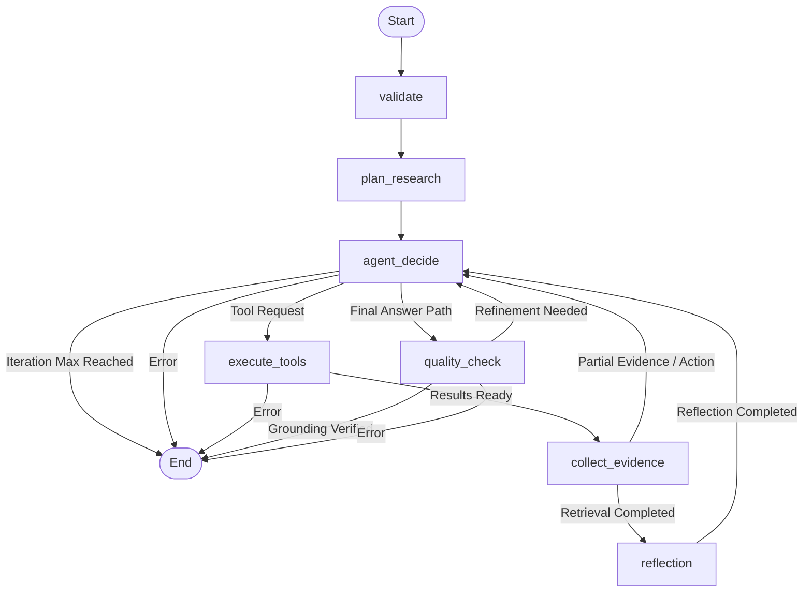

# Agent Execution Flow

The AI Research Agent uses LangGraph to manage its complex execution loops deterministically. This execution engine operates strictly through defined graph nodes, conditional routing paths, and iteration limits to prevent infinite processing.

## Graph Node Flow

## Node Behaviors

- **Validate:** Evaluates the structure and length of the user's prompt, verifies session presence, and constructs the initial `AgentState` before allowing the system to proceed.
- **Plan Research (`plan_research`):** Analyzes the prompt via the LLM to classify user intent. The agent does NOT automatically search the local database. If the intent suggests the user requires mathematical help, the planner tags `requires_calculation`. If they require web updates, it tags `requires_web`. This prevents unnecessary retrieval steps.
- **Agent Decision (`agent_decide`):** The core ReAct loop router. The LLM reviews the research plan, context history, and any tool outputs to decide if it has enough information to formulate an answer or if it must invoke a function. If it hits the defined max iteration limit, it stops execution to prevent infinite looping.
- **Tool Execution (`execute_tools`):** Translates LLM function invocations into concrete local Python calls (e.g., executing the math calculation or querying a database). 
- **Evidence Collection (`collect_evidence`):** Parses raw strings from tool outputs into structured `EvidenceItem` objects. If the research plan required multi-source research and only one source is currently fetched, it will dynamically push the agent back to the decision loop to fetch the remainder.
- **Reflection (`reflection`):** Evaluates if the collected chunk of evidence directly supports answering the query. If insufficient, it forces the agent back to the decision node to attempt a refined search.
- **Quality Check (`quality_check`):** After the agent formulates its final answer, this node intercepts the text and performs an automated grounding validation. It breaks the text into claims and scores them against the evidence. If severe unsupported claims exist, it rejects the text and routes back to the agent for a one-time refinement cycle.
- **Error Handling:** Any critical exceptions caught during API integration or parsing immediately route to the END node, storing standard error logs rather than throwing application crashes.
