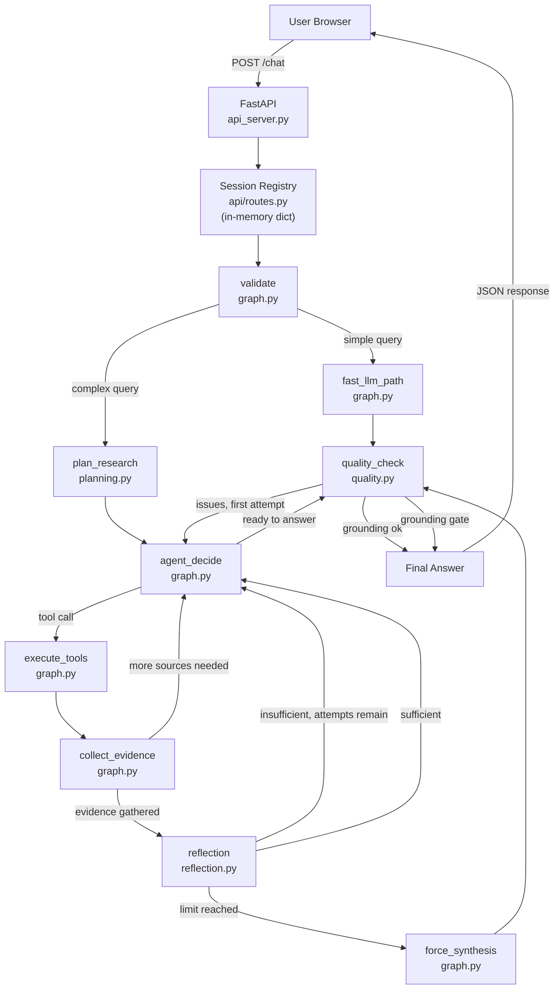

# Architecture

This document describes the technical architecture of AI Research Agent V1.0 as implemented in the frozen codebase.

---

## System Diagram



---

## Layer Breakdown

### 1. HTTP Layer — `api_server.py`, `api/routes.py`, `api/models.py`

FastAPI serves both the REST API and the static frontend files. All routes are defined in `api/routes.py` and mounted via `api_server.py`.

- Sessions are stored in a plain Python `dict[str, AgentSession]` in `api/routes.py`. Sessions are **in-memory only** — they are lost on process restart.
- A session is created on the first `POST /chat` request without a `session_id`. Subsequent requests should include the returned `session_id` to maintain conversation continuity.
- If a `session_id` is provided but not found (e.g., after a server restart), the route returns HTTP 404. The frontend detects this and automatically retries without a session ID to create a fresh session.

### 2. LangGraph Orchestration — `graph.py`

The entire agent workflow is a `StateGraph` from LangGraph. Nodes are plain Python functions; edges are conditional on `next_action` values in the graph state.

**Graph nodes and their responsibilities:**

| Node | Function | Responsibility |
|---|---|---|
| `validate` | `graph.py:validate` | Sanitise input, attach session, classify simple/complex |
| `plan_research` | `graph.py:plan_research` | Generate `ResearchPlan`, inject guidance into context |
| `fast_llm_path` | `graph.py:fast_llm_path` | Direct LLM call for simple queries, skips tool loop |
| `agent_decide` | `graph.py:agent_decide` | LLM step — returns tool call or text answer |
| `execute_tools` | `graph.py:execute_tools` | Dispatch tool call to `TOOL_REGISTRY` |
| `collect_evidence` | `graph.py:collect_evidence` | Parse tool results into `EvidenceItem` list |
| `reflection` | `graph.py:reflection` | Call `evaluate_evidence()`, route on sufficiency |
| `force_synthesis` | `graph.py:force_synthesis` | Direct LLM synthesis when reflection limit is reached |
| `quality_check` | `graph.py:quality_check` | Claims, grounding, citations, grounding gate |

**Key graph state fields (`GraphState` TypedDict):**

- `prompt` — the original user query
- `max_iterations` — iteration ceiling (default from `settings.max_agent_iterations = 5`)
- `session` — the `AgentSession` object
- `agent_state` — the `AgentState` dataclass carrying all evidence, traces, and results
- `llm_response` — the last `AgentResponse` from the provider
- `next_action` — routing signal (`"tools"`, `"quality_check"`, `"agent_decide"`, `"end"`)
- `is_simple` — whether the query was classified as a simple fast-path query

### 3. Query Planning — `planning.py`

Planning is **deterministic keyword matching**, not LLM-based classification.

`is_simple_query(query)`:
- Returns `True` only for short (<100 chars) queries starting with `"what is"`, `"who is"`, etc. and containing no research-indicating keywords.
- Simple queries skip the tool loop entirely.

`create_research_plan(query)`:
- Detects `is_web` via keywords: `["latest", "current", "today", "recent", "news", "web"]`
- Detects `is_local` via keywords: `["according to my", "local documentation", "my files", …]`
- Detects `is_calc` via regex math operators.
- Sets `intent` to one of: `"web_research"`, `"local_research"`, `"comparative_research"`, `"calculation"`, `"general_knowledge"`.

### 4. Tool Layer — `tools.py`, `agent.py`

Three tools are registered:

| Tool | Function | What it does |
|---|---|---|
| `search_web` | `tools.py:search_web` | DuckDuckGo text search via `ddgs`; returns up to 10 results |
| `search_local_knowledge` | `tools.py:search_local_knowledge` | Embeds query, searches ChromaDB, returns top-3 chunks |
| `calculate_product` | `tools.py:calculate_product` | Integer multiplication |

`TOOL_REGISTRY` in `agent.py` maps tool name strings to callables. `FUNCTION_DECLARATIONS` defines the JSON schema sent to the LLM provider.

### 5. Evidence Model — `research.py`

```python
@dataclass
class EvidenceItem:
    content: str        # The snippet or chunk text
    source: str         # "Title (URL)" for web, "filename" for local
    source_type: str    # "web" or "local"
    metadata: dict      # URL, chunk_index, distance, etc.
    relevance: float | None
```

`parse_web_evidence()` and `parse_local_evidence()` parse the raw formatted strings returned by the tool functions into `EvidenceItem` lists.

### 6. Reflection — `reflection.py`

`evaluate_evidence(query, evidence)` builds a `ChatPromptTemplate` prompt and calls `call_llm_structured()` to obtain a `ReflectionResult(sufficient: bool, reason: str)`.

The reflection evaluator is instructed to:
- Judge ONLY the supplied evidence (no outside knowledge)
- Return `sufficient=True` only when evidence **fully and directly** supports the query
- Provide a brief reason

**Limits:**
- `max_reflection_attempts` (default 2) prevents infinite research loops.
- When the limit is reached, the graph routes to `force_synthesis` regardless of the sufficiency judgment.

### 7. Quality Control — `quality.py`

See [grounding-and-citations.md](grounding-and-citations.md) for full detail.

Brief summary:
1. `extract_claims()` — extracts ≤20 claims, ranked by information density
2. `assess_claims()` — token-overlap grounding against each `EvidenceItem`
3. `validate_citations()` — strict substring match of citation tags
4. `apply_grounding_gate()` — chunked LLM rewrite for problematic sections

### 8. State and Tracing — `state.py`

`AgentState` is a plain Python dataclass (not Pydantic, not LangGraph state). It is carried through the graph in `GraphState["agent_state"]`.

Every major event appends a `TraceEvent` to `state.trace`. The full trace is returned to the frontend in the `POST /chat` response under `trace`.

### 9. LLM Provider Abstraction — `providers/`

Three provider implementations share a common structural interface (enforced by duck typing against `LLMProvider` Protocol):

| Provider | Module | Methods |
|---|---|---|
| Gemini | `providers/gemini.py` | `generate()`, `generate_structured()`, `generate_agent_step()` |
| OpenRouter | `providers/openrouter.py` | `generate()`, `generate_structured()`, `generate_agent_step()` |
| Groq | `providers/groq.py` | `generate()`, `generate_structured()`, `generate_agent_step()` |

`get_provider(name)` in `providers/__init__.py` is the factory. The active provider is selected by `LLM_PROVIDER` environment variable.

`RetryableProviderError` and `FatalProviderError` in `providers/errors.py` allow the API layer to distinguish between transient failures (retryable) and permanent failures.

### 10. Memory — `memory.py`

`ConversationMemory` holds an ordered list of `ConversationMessage(role, content)` objects.
`AgentSession` pairs a UUID with a `ConversationMemory`.
Sessions are created by `create_session()` and stored in the in-memory `sessions` dict in `api/routes.py`.

**Important**: Sessions are not persisted. A server restart clears all sessions.

### 11. LangChain Integration — `langchain_integration.py`

Used selectively for:
- `get_rag_prompt_template()` — RAG generation `ChatPromptTemplate`
- `get_reflection_prompt_template()` — reflection evaluator `ChatPromptTemplate`
- `LangChainRetrieverAdapter` — exposes the `FallbackVectorStore` as a LangChain `BaseRetriever`

The codebase does **not** use LangChain chains, agents, or tools — only prompt templates and the retriever adapter.

### 12. Frontend — `frontend/`

Static files (`index.html`, `style.css`, `app.js`) are served by FastAPI via `StaticFiles`.

`app.js` manages:
- Chat message submission to `POST /chat`
- Session ID persistence in `localStorage`
- Automatic 404 recovery (clears stale session ID and retries once without it)
- Rendering the streamed response, source citations, and agent trace

---

## Configuration Reference

All configuration is in `config.py` via `pydantic-settings`:

| Setting | Default | Description |
|---|---|---|
| `max_agent_iterations` | 5 | Maximum LangGraph tool iterations |
| `max_reflection_attempts` | 2 | Maximum reflection loops before force synthesis |
| `grounding_threshold` | 0.70 | Grounding score below which the gate triggers |
| `max_message_length` | 10000 | Maximum user message character length |
| `vector_db` | `chroma` | Primary vector backend |
| `vector_db_fallback_enabled` | `True` | Enable Pinecone fallback if Chroma fails |
| `retrieval_fusion_enabled` | `False` | Enable dual-backend retrieval fusion |
| `retrieval_fusion_top_k` | 5 | Candidates fetched per backend in fusion mode |
| `retrieval_final_k` | 3 | Final number of results after fusion |
