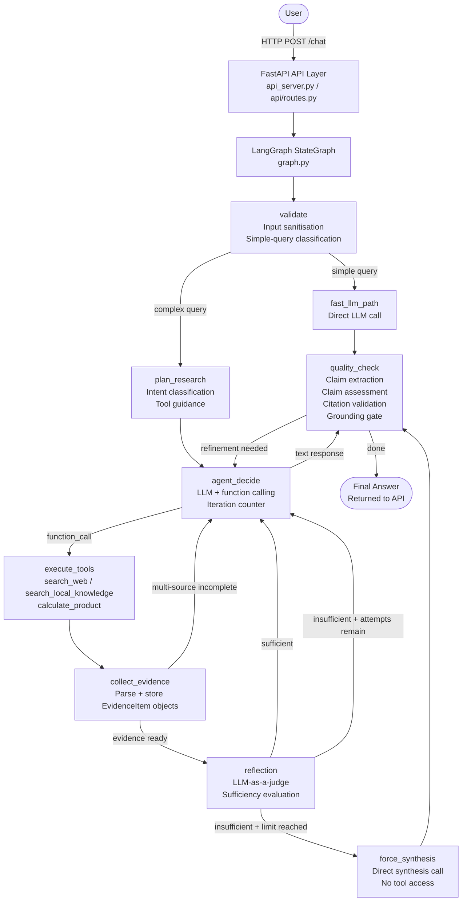

# AI Research Agent V1.0 — Complete Project Write-up

**Author**: Chandra Shekar  
**GitHub**: https://github.com/chandra8688/AI_Research_Agent  
**Production URL**: https://ai-research-agent-sj1r.onrender.com/  
**Status**: V1.0 — Feature Complete and Frozen  
**Final Test Count**: 125 tests passing

---

## 1. Executive Summary

AI Research Agent V1.0 is an autonomous research system that accepts a natural-language question, conducts multi-step web and local document retrieval, reflects on whether the collected evidence is sufficient, synthesises a grounded answer, and then verifies every claim in that answer against the retrieved sources before returning it to the user.

The central engineering problem it addresses is that large language models generate confident-sounding text that may go beyond what retrieved sources actually contain. The system combats this not through prompt engineering alone, but through a deterministic post-answer verification pipeline: claims are extracted from the LLM's answer, each is tested for lexical support in the evidence corpus, unsupported or conflicting claims are identified, and a secondary LLM pass rewrites those sections before the answer is shown. Every source citation is also format-validated against the actual retrieved identifiers.

The system is deployed as a containerised FastAPI service on Render, served through a vanilla HTML/CSS/JavaScript frontend, and has 125 offline unit tests.

---

## 2. Problem Statement

Standard LLM chat applications suffer from a structural weakness: the model answers from its training-time weights, without any obligation to cite real, current sources. When a model is asked to research a topic, it will often produce an answer that sounds authoritative but contains invented statistics, outdated figures, or subtly fabricated citations.

Adding a basic RAG pipeline (retrieve-then-generate) partially addresses this, but leaves several gaps:
- The model still adds background knowledge not present in the retrieved chunks.
- Retrieved web snippets may be short and low-information.
- The model may hallucinate source names that were never retrieved.
- Without iterative research, the first retrieval pass may be insufficient.

Standard agent loops improve retrieval depth but rarely verify the final answer against the retrieved evidence. A model that has called `search_web` three times and accumulated hundreds of tokens of context will still hallucinate fluently if unchecked.

AI Research Agent V1.0 treats post-generation grounding as a first-class engineering concern: the pipeline does not stop at generating an answer; it inspects the answer.

---

## 3. Project Objectives

The objectives that are actually reflected in the final implementation are:

1. Accept a research question through an API and a web frontend.
2. Classify the query to route simple factual questions to a fast direct path.
3. Construct a deterministic research plan (intent classification, tool requirements).
4. Execute an iterative tool-calling loop using an LLM with function-calling.
5. Retrieve evidence from two channels: live web search and a local vector database.
6. Evaluate evidence sufficiency using an LLM-as-a-judge reflection step.
7. Re-search if evidence is insufficient, up to a configurable limit.
8. Generate a final answer with required source citations.
9. Extract factual claims from the answer.
10. Assess each claim against retrieved evidence using lexical token overlap.
11. Detect numerical and negation conflicts between claims and evidence.
12. Validate citation format and source identifiers against actual retrieved sources.
13. Rewrite under-supported sections using a secondary LLM prompt (grounding gate).
14. Return the final, grounded answer to the user with an execution trace.
15. Abstract LLM providers so Gemini, OpenRouter, and Groq are interchangeable.
16. Containerise the full pipeline with a build-time RAG ingestion step.
17. Deploy to a production host with a health and readiness API.
18. Maintain 125 offline unit tests covering the critical correctness paths.

---

## 4. Final Product

The production application is accessible at **https://ai-research-agent-sj1r.onrender.com/**

A user visits the URL and sees a two-panel interface: a left sidebar listing past conversation sessions (stored in browser `localStorage`), and a main area with a chat input. Typing a research question and pressing "Ask Agent" (or Enter) sends the query to the FastAPI backend.

During execution, a typing-indicator animation is shown. When the agent completes, the response renders in the chat bubble, followed by a "SOURCES" section listing retrieved local document chunks, and an "AGENT EXECUTION" section showing the execution trace (tool calls, reflections, claim assessments, citation validations). The user can start a new conversation at any time, browse previous ones in the sidebar, or delete individual sessions.

There is no authentication or login system. There is no persistent database; all server-side session state is in process memory and is lost on container restart. The frontend handles this automatically (see Section 22.1).

---

## 5. Technology Stack

| Layer | Technology | Notes |
|---|---|---|
| Agent Orchestration | LangGraph (`langgraph`) | `StateGraph` with conditional routing |
| Prompt Templates | LangChain Core (`langchain-core`) | `ChatPromptTemplate` for reflection |
| LLM — Primary | Gemini (`google-genai`) | `gemini-3.5-flash` model |
| LLM — Fallback A | OpenRouter (`requests`-based) | Configurable model, e.g. `openai/gpt-oss-20b:free` |
| LLM — Fallback B | Groq (`groq`) | Added in `013c760` |
| Web Search | DuckDuckGo Search (`ddgs`) | Live results, no authentication |
| Local Embeddings | Sentence-Transformers | `all-MiniLM-L6-v2`, CPU, 384-dim, ~80MB |
| Primary Vector Store | ChromaDB (`chromadb`) | Persistent local, file-backed |
| Optional Vector Store | Pinecone (`pinecone`) | Cloud fallback, requires API key |
| Backend Framework | FastAPI + Uvicorn | REST API + static file serving |
| Configuration | Pydantic Settings | `.env` file, environment variables |
| Retry Logic | Tenacity | Exponential back-off for provider calls |
| Frontend | HTML + CSS + JavaScript | Vanilla, zero build step |
| Container | Docker | `python:3.12-slim`, build-time RAG init |
| Local Dev Orchestration | Docker Compose | Environment variable passthrough |
| Deployment | Render | Web service, free tier |
| Testing | `unittest` (stdlib) + `httpx` + `starlette.testclient` | 125 offline tests |

**Not implemented in V1.0**: Kubernetes, Helm, Redis, persistent relational database, authentication/login, semantic reranking, CI/CD pipeline, streaming responses.

---

## 6. High-Level Architecture



The graph is compiled once at module load and shared across requests. Each request creates an isolated `GraphState` dictionary; there is no shared mutable state between concurrent requests beyond the session registry dict in `api/routes.py`.

---

## 7. End-to-End Request Lifecycle

This section traces a single complex research question through every node.

### Step 1: API ingress (`api/routes.py:chat_endpoint`)
The request arrives as `POST /chat` with `{"message": "...", "session_id": "..."}`. Input is length-validated against `settings.max_message_length` (default 10,000 characters). If a `session_id` is provided and found in the in-memory `sessions` dict, that session is used; otherwise a new `AgentSession` (UUID-keyed) is created.

### Step 2: Graph invocation (`agent.py:execute_agent`)
`execute_agent_graph()` in `graph.py` is called with the prompt, optional `max_iterations`, and the session. An initial `GraphState` dict is passed to `graph.invoke()`.

### Step 3: `validate` node
- Strips and validates the prompt.
- Calls `memory.create_session()` if no session was provided.
- Adds the user message to `session.memory`.
- Builds the initial `AgentState` with the conversation history truncated to the last 10 messages.
- Calls `is_simple_query()` from `planning.py` to determine routing.

### Step 4a: `fast_llm_path` (simple queries only)
If `is_simple_query()` returns `True` (query is short, starts with "what is / who is / when did", contains no research-implying keywords), the graph skips planning and tool execution, calls `provider.generate(prompt)` directly, and routes to `quality_check`. The `quality_check` node detects `is_simple=True` and skips the evidence grounding pass, returning the answer immediately.

### Step 4b: `plan_research` node (complex queries)
`create_research_plan()` in `planning.py` performs deterministic keyword-based intent classification:
- Presence of `"local knowledge"`, `"my files"`, etc. → `requires_local_knowledge=True`
- Presence of `"latest"`, `"current"`, `"today"`, etc. → `requires_web=True`
- Arithmetic operators or calculation keywords → `requires_calculation=True`
- Both local and web → `requires_multi_source_research=True`

The plan is attached to `agent_state.research_plan` and guidance is injected into the conversation context, telling the LLM which tools are recommended.

### Step 5: `agent_decide` node
The LLM is called via `provider.generate_agent_step(messages, FUNCTION_DECLARATIONS)`. FUNCTION_DECLARATIONS exposes three tools: `search_web`, `search_local_knowledge`, `calculate_product`. The agent's iteration counter is incremented; if it exceeds `settings.max_agent_iterations` (default 5) the run terminates with an error. If the LLM responds with a function call, the node routes to `execute_tools`. If the LLM responds with text (the final answer), it routes to `quality_check`.

### Step 6: `execute_tools` node
The first function call from the LLM is executed. The tool name is looked up in `TOOL_REGISTRY` (dict of callables). The tool executes and the raw string result is stored. The node routes to `collect_evidence`.

### Step 7: `collect_evidence` node
The tool result is parsed:
- If from `search_local_knowledge`: `parse_local_evidence()` extracts `EvidenceItem` objects with `source_type="local"`.
- If from `search_web`: `parse_web_evidence()` extracts `EvidenceItem` objects with `source_type="web"`, using title and URL as the `source` field.

Items are appended to `agent_state.multi_source_evidence`. If `requires_multi_source_research=True` and both local and web evidence has not yet been collected, the node routes back to `agent_decide` for another tool call. Otherwise it routes to `reflection`.

### Step 8: `reflection` node
`evaluate_evidence()` in `reflection.py` builds a prompt via `langchain_integration.get_reflection_prompt_template()` and calls `call_llm_structured(prompt, ReflectionResult)` to obtain a structured `ReflectionResult(sufficient: bool, reason: str)`.

- If `sufficient=True`: the evidence summary is injected with synthesis instructions and the node routes back to `agent_decide` so the LLM can generate a cited final answer (without calling more tools).
- If `sufficient=False` and `reflection_attempts < max_reflection_attempts` (default 2): the evidence is injected with an INSUFFICIENT signal and a refinement hint, routing back to `agent_decide` for more research.
- If `sufficient=False` and the limit is reached: the node routes to `force_synthesis`.

### Step 9: `force_synthesis` node (limit path only)
`force_synthesis()` bypasses the agent loop entirely. It calls `provider.generate(synthesis_prompt)` directly — a prompt constructed with all accumulated evidence and strict citation instructions. The result is wrapped in an `AgentResponse` and forwarded to `quality_check`. The LLM is not offered tools in this step.

### Step 10: `quality_check` node
This is the post-generation verification stage:
1. `extract_claims(final_text)` — extracts up to 20 factual claims.
2. If `is_simple=True`, skip to step 5.
3. `assess_claims(claims, multi_source_evidence)` — token-overlap grounding.
4. `validate_citations(final_text, multi_source_evidence)` — citation format check.
5. If issues found and `refinement_attempted=False`: inject a grounding warning into the conversation and route back to `agent_decide` for one self-correction attempt.
6. If issues persist (or refinement was already attempted): `apply_grounding_gate()` rewrites problematic sections.
7. The final text is stored as `agent_state.final_answer` and added to session memory.

### Step 11: Response returned
The API endpoint constructs a `ChatResponse` with: `session_id`, `answer`, `iterations`, `tool_calls`, `sources`, and `trace`. The trace is a serialised list of `TraceEvent` objects accumulated throughout the run.

---

## 8. LangGraph Agent Architecture

### `GraphState`
`GraphState` is a `TypedDict` that serves as the shared data structure passed between nodes:

```python
class GraphState(TypedDict):
    prompt: str
    max_iterations: int
    session: Any           # AgentSession
    agent_state: AgentState
    llm_response: Any      # AgentResponse
    error: str | None
    next_action: str
    is_simple: bool
```

Each node receives the current state and returns a partial dict with only the keys it modifies. LangGraph merges these updates.

### Nodes
| Node | File | Purpose |
|---|---|---|
| `validate` | `graph.py` | Input validation, session init, simple-query routing |
| `plan_research` | `graph.py` | Deterministic intent classification |
| `agent_decide` | `graph.py` | LLM tool-or-answer decision, iteration limit |
| `execute_tools` | `graph.py` | Tool dispatch from `TOOL_REGISTRY` |
| `collect_evidence` | `graph.py` | Parse raw tool output into typed `EvidenceItem` objects |
| `reflection` | `graph.py` | LLM-as-a-judge evidence sufficiency check |
| `force_synthesis` | `graph.py` | Direct synthesis when reflection limit is reached |
| `fast_llm_path` | `graph.py` | Direct LLM answer for simple queries |
| `quality_check` | `graph.py` | Claim extraction, grounding, citation validation |

### Conditional Edges
The graph uses `add_conditional_edges` throughout. Routing decisions are made by functions (`route_validate`, `route_agent_decide`, `route_tools`, `route_collect`, `route_reflection`, `route_force_synthesis`, `route_quality`) that read `state["next_action"]` and `state["error"]`. This keeps routing logic separate from business logic inside nodes.

### Iteration Safeguards
- **Max iterations**: `agent_decide` increments `agent_state.iteration` before each LLM call. If `iteration >= max_iterations`, the run terminates with an error.
- **Max reflection attempts**: `reflection` tracks `agent_state.reflection_attempts`. When the limit is reached, the node hard-routes to `force_synthesis` — the LLM cannot override this.
- **One refinement attempt**: `quality_check` tracks `agent_state.refinement_attempted`. If grounding issues are found on the first pass, the agent gets one self-correction attempt. On the second pass, the grounding gate is applied regardless.

---

## 9. Research Planning

`planning.py` provides two functions:

**`is_simple_query(query)`**: Returns `True` only if the query is ≤100 characters, starts with one of `["what is", "who is", "who invented", "where is", "what's", "who's", "when did"]`, and contains none of the complexity keywords (`"latest"`, `"current"`, `"compare"`, `"vs"`, `"evidence"`, `"research"`, etc.). This classification is deliberately conservative: most queries route through the full research pipeline.

**`create_research_plan(query)`**: Applies keyword pattern matching to populate a `ResearchPlan` dataclass with boolean flags (`requires_web`, `requires_local_knowledge`, `requires_calculation`, `requires_multi_source_research`) and a string `intent`. The intent controls which system guidance is appended to the user message before the first `agent_decide` call. The plan itself is not sent to the LLM; its guidance string is injected into the conversation context.

**Limitation**: Planning uses keyword matching, not semantic understanding. A query about "recent AI developments" that doesn't include the exact word "current" could be misclassified. In practice the `agent_decide` LLM tends to call the appropriate tools anyway because the system prompt remains flexible.

---

## 10. Web Research

**Tool**: `search_web(query, max_results=3)` in `tools.py`

The tool calls `DDGS().text(query, max_results=max_results)` from the `ddgs` library. Results are formatted as:

```
[Result 1]
Title: <title>
URL: <url>
Snippet: <body snippet>
```

`parse_web_evidence()` in `research.py` parses this format into `EvidenceItem` objects. The `source` field is `"<title> (<url>)"`, which becomes the citation identifier. The `content` is the snippet text.

**Limitations**:
- DuckDuckGo results are short snippets, not full article content.
- There is no domain authority filtering or source credibility ranking. Results from any domain are treated equally.
- Search results can be stale or inaccurate depending on DuckDuckGo's index.
- The agent cannot follow links or read full article text; only the DuckDuckGo snippet is available to the grounding system.

---

## 11. RAG Pipeline

The local RAG pipeline ingests `.txt` documents from the `docs/` directory at Docker build time and stores them in a persistent ChromaDB collection at `.chroma_db/`.

### Document Loading (`rag/loader.py`)
Reads all `.txt` files from the specified directory. Each file becomes one `Document(content=..., metadata={"source": filename})`.

### Chunking (`rag/chunker.py`)
`chunk_document()` applies a sliding-window character split:
- `chunk_size=500` characters
- `overlap=100` characters
- Step: `500 - 100 = 400` characters per chunk
- Each chunk inherits the parent's metadata plus `chunk_index` and `chunk_count`.

A document shorter than 500 characters produces exactly one chunk.

### Embeddings (`rag/embedder.py`)
`embed_chunks()` loads `sentence-transformers/all-MiniLM-L6-v2` locally (384-dimensional dense vectors, CPU inference). All chunks are encoded in a single `model.encode()` batch call. The HuggingFace model cache is stored at `$HF_HOME` (defaulting to `.hf_cache/` in the project root), ensuring it is retained inside the Docker image.

### Vector Store (`rag/store.py`, `rag/chroma_store.py`)
The primary backend is **ChromaDB** (`PersistentClient`, file-backed at `.chroma_db/`). Chunks are upserted with their text, metadata, and embedding vectors. A `VectorStore` protocol is defined so the store is fully swappable.

A `FallbackVectorStore` wraps primary + fallback backends. If the primary raises a `RetryableRetrievalError`, it automatically falls back to the configured secondary (default: Pinecone). Pinecone is optional; it requires `PINECONE_API_KEY` and `PINECONE_INDEX_NAME` environment variables.

A `FusionVectorStore` is also implemented (enabled via `RETRIEVAL_FUSION_ENABLED=true`). It queries both Chroma and Pinecone in parallel and merges results using Reciprocal Rank Fusion (see Section 12). This mode is **not enabled by default** in the V1.0 production deployment.

### Retrieval (`tools.py:search_local_knowledge`)
At query time, the user's query is embedded using the same `embed_chunks()` function (via a single-item list), and `store.search(query_embedding, k=3)` is called. The top 3 results by L2 distance are returned with distance scores in metadata.

### Build-time Initialisation
The `Dockerfile` runs `python scripts/build_rag.py` as a `RUN` layer during `docker build`. This loads and embeds all documents before the container is deployed. At runtime, `api_server.py`'s startup event logs the configuration but does not re-initialise the RAG — it is already initialised.

`rag/pipeline.py:initialize_knowledge_base()` checks `store.count() > 0` before re-ingesting. If chunks already exist, initialisation is skipped. This is safe for idempotent re-runs.

---

## 12. Evidence Fusion

When `RETRIEVAL_FUSION_ENABLED=true`, the `FusionVectorStore` in `rag/store.py` queries both Chroma and Pinecone with the same embedding vector. Results are merged by `rag/reranker.py:fuse_results()` using **Reciprocal Rank Fusion (RRF)**:

```
RRF_score(doc, rank) = 1 / (K + rank)   where K = 60
```

If a document appears in both backends (matched by `source + chunk_index`), its scores are summed. Results are then sorted descending by `normalized_score` and the top `final_k` (default 3) are returned.

In the default V1.0 production deployment, `retrieval_fusion_enabled=False`. The `FallbackVectorStore` is used instead: it queries only the primary backend (Chroma), and falls back to Pinecone only if Chroma raises a `RetryableRetrievalError`. Web evidence and local evidence are combined by simple list concatenation in `collect_evidence`.

---

## 13. Reflection Loop

The reflection system implements an LLM-as-a-judge pattern to evaluate whether accumulated evidence is actually sufficient to answer the user's question.

**Prompt**: Built by `langchain_integration.get_reflection_prompt_template()`. The system prompt instructs the LLM to evaluate only the supplied evidence, return `sufficient=True` only when evidence directly and fully supports the query, and always provide a `reason`.

**Structured output**: `call_llm_structured(prompt, ReflectionResult)` uses the provider's structured generation capability (Gemini's `response_mime_type="application/json"`) to parse the response directly into a `ReflectionResult(sufficient: bool, reason: str)` Pydantic model.

**Loop control**:
- Sufficient: evidence + synthesis instructions are injected into the conversation; `agent_decide` is called again. The LLM, now seeing the SUFFICIENT signal and full evidence, generates a final answer without requesting more tools.
- Insufficient + attempts remaining: evidence + INSUFFICIENT signal + refinement hint are injected; `agent_decide` is called to issue a refined search query.
- Insufficient + limit reached (`reflection_attempts >= max_reflection_attempts`): the node hard-routes to `force_synthesis`. This is a graph-level enforcement — the LLM does not decide this.

---

## 14. Answer Synthesis

Synthesis can occur in two ways:

**Normal path**: After the reflection node injects the SUFFICIENT signal, the LLM in `agent_decide` receives the complete evidence text along with instructions to distinguish local from web evidence, attribute claims to sources using `[LOCAL: ...]` / `[WEB: ...]` citation formats, not invent unsupported claims, and acknowledge conflicting evidence.

**Force synthesis path**: When the reflection limit is reached, `force_synthesis()` calls `provider.generate(synthesis_prompt)` with a custom prompt that provides all accumulated evidence and the same citation and accuracy instructions. No tools are available in this call. The result feeds into `quality_check` identically to the normal path.

In both paths, the synthesis step does not guarantee that citations will be correct or that all claims will be grounded. That responsibility belongs to `quality_check`.

---

## 15. Claim Extraction and Assessment

### Claim Extraction (`quality.py:extract_claims`)

1. **Table rows** are extracted first (lines matching `|...|` with no `---` separator).
2. The text with table markup removed is split on sentence terminators and newlines.
3. Each sentence is filtered:
   - Too short (< 15 chars) → dropped.
   - Starts with `#` (heading) or ends with `:` → dropped.
   - Short (< 50 chars) and starts with boilerplate (`"based on"`, `"here is"`, `"according to"`, etc.) → dropped.
4. Citation tags `[LOCAL: ...]` / `[WEB: ...]` are stripped before storing.
5. If more than 20 candidates remain, they are ranked by **unique meaningful-token count** (after lowercasing, punctuation removal, and stop-word filtering) and only the top 20 are kept. This bounds the grounding cost for long research answers.

### Claim Assessment (`quality.py:assess_claims`)

For each claim, every `EvidenceItem` is compared using **lexical token overlap**:

```python
overlap = len(claim_tokens ∩ evidence_tokens) / len(claim_tokens)
if overlap >= 0.35:
    supporting.append(item.source)
```

A claim is marked `supported=True` if at least one evidence item meets the 0.35 threshold and no conflicting evidence is detected.

### Conflict Detection (`quality.py:detect_conflict`)

Two surface-level heuristics:
1. **Numerical contradiction**: claim and evidence contain numbers, their number sets are disjoint, and they share ≥ 2 meaningful tokens → conflict.
2. **Negation mismatch**: one of `"does not"`, `"is not"`, `"cannot"`, `"will not"` is present in the claim but not the evidence (or vice versa), and token overlap ≥ 40% → conflict.

### Grounding Score

```python
score = (len(claims) - len(unsupported_claims)) / len(claims)
```

Ranges 0.0–1.0.

### Known and Documented Limitation: Token Overlap Is Not Semantic Understanding

The token-overlap method is a **lexical similarity check**. It measures whether the same words appear in both the claim and the evidence.

This means:
- A claim that paraphrases evidence using different vocabulary may be marked unsupported even if it is factually correct.
- A claim that shares vocabulary with semantically unrelated evidence may be marked supported incorrectly.
- Semantic contradictions that use different words (e.g., "the company grew" vs. "the company contracted") are not detected.

The system is honest about this in the README and docs. It is not semantic fact-checking. It is a deterministic, lightweight heuristic chosen for its predictability, testability, and zero external API dependency.

---

## 16. Grounding Gate

`quality.py:apply_grounding_gate()` is invoked from `quality_check` when:
- `overall_grounding_score < settings.grounding_threshold` (default 0.70), **or**
- `unsupported_claims` is non-empty, **or**
- `conflicts_detected` is non-empty.

### Process

1. **Chunking**: The answer is split into chunks of at most **1,500 characters** by `_chunk_text()` (three-level recursive split: `\n\n` → `\n` → hard character split). This guarantees no chunk exceeds the limit regardless of how the LLM formatted the answer.

2. **Per-chunk relevance check**: For each chunk, `_is_claim_relevant(claim, chunk)` is called on each unsupported claim and conflict. A claim is relevant to a chunk if its token overlap with the chunk ≥ 30%. Chunks with no relevant issues are passed through **unmodified** — only the affected sections are rewritten.

3. **LLM rewrite**: For chunks with issues, the LLM is prompted with a fact-checking role, the available source catalog, the unsupported claims, detected conflicts, and the draft chunk. The prompt instructs the LLM to:
   - Remove or heavily qualify unsupported claims.
   - Gracefully omit unsupported negative claims rather than replacing them with formulaic hedging language.
   - Flag genuine conflicts as disagreements between sources.
   - Preserve citation tags for supported claims.
   - Preserve headings and markdown structure.

4. **Retry**: The LLM call uses `@retry` from `tenacity` with exponential back-off: minimum 3 seconds, maximum 35 seconds, up to 5 attempts, only triggered on `RetryableProviderError`. There is no unconditional sleep.

5. **Fallback**: If all retries fail, the original chunk is returned unmodified. The pipeline does not abort.

6. **Reassembly**: All chunk outputs (rewritten or original) are joined with `\n\n`.

### What the Grounding Gate Does Not Do

- It does not perform semantic fact-checking.
- It does not access the internet to verify claims.
- It does not guarantee all hallucinations are removed — it operates on the claims identified by the token-overlap system.
- It does not prevent the rewriting LLM from itself hallucinating in the rewritten sections, though the prompt is designed to minimise this.

---

## 17. Citation Validation

`quality.py:validate_citations()` performs format and source-identifier validation.

1. All `[LOCAL: ...]` and `[WEB: ...]` tags are extracted from the answer using `re.findall`.
2. A set of valid source strings is built from `{item.source for item in evidence}`.
3. For each extracted citation string, a bidirectional substring check is performed against every valid source:
   - `citation_text in valid_source` **or** `valid_source in citation_text`
4. Any citation that fails this check is added to the invalid list.
5. If evidence was retrieved but the answer contains **no citations at all**, `"No source citations were provided."` is added to the invalid list.

**What this validates**: That citation tags contain recognisable substrings of actual retrieved source identifiers. An invented URL or fabricated title that was never retrieved will fail this check.

**What this does not validate**: Whether a cited source actually supports the adjacent claim, whether the quoted information is accurate, or whether the cited page exists and is accessible.

The citation formats enforced by the system prompts are:
- Web: `[WEB: Page Title (https://url)]`
- Local: `[LOCAL: filename.txt]`

---

## 18. Production Frontend

The frontend is three files: `frontend/index.html`, `frontend/style.css`, `frontend/app.js`. They are served as static files by FastAPI via `app.mount("/static", ...)`, with `GET /` returning `index.html`.

### Features (all verified in `app.js`)

**Chat interface**: Single-page application with a left sidebar for conversation history and a main chat area. Messages use DOM `textContent` assignment (not `innerHTML`) for the answer content, preventing XSS from LLM output.

**Session management**: `currentSessionId` is kept in memory. When a response arrives, the `session_id` from the API is stored in the `conversations` array in `localStorage`. On reload, the most recent conversation is auto-loaded, restoring its session ID so follow-up questions remain in context.

**Conversation sidebar**: Lists all saved conversations grouped by TODAY / YESTERDAY / OLDER, sorted by `updatedAt`. Each entry shows a title (first 45 characters of the first message) and a delete button.

**Execution trace display**: The `trace` array from the API response is rendered as an "AGENT EXECUTION" section showing each step: tool calls, reflection results, errors, and final answer generation.

**Health indicator**: Polls `GET /health` every 30 seconds and shows an online/offline dot.

**Error handling in the UI**: Separate display logic for HTTP 400, 404, 429, 502, 503, and generic errors. Each maps to an appropriate user-facing message.

**Stale session recovery**: Described in Section 22.1.

---

## 19. LLM Provider Architecture

### Provider Protocol (`providers/__init__.py`)
A `LLMProvider` Protocol defines three methods all providers must implement:
- `generate(prompt: str) -> str`
- `generate_structured(prompt: str, schema: type[BaseModel]) -> BaseModel`
- `generate_agent_step(messages: list[dict], tools: list[dict]) -> AgentResponse`

`AgentResponse` is a dataclass containing `text`, `function_calls`, and `model_message`.

### Provider Error Classification (`providers/errors.py`)
- `RetryableProviderError`: transient failures (429, 5xx, timeouts) — eligible for retry or fallback.
- `FatalProviderError`: non-retryable failures (400, 401, other client errors) — surfaced immediately.

### Implemented Providers

**Gemini** (`providers/gemini.py`): Uses `google-genai` SDK, model `gemini-3.5-flash`. Supports native function calling via `types.FunctionDeclaration` and `types.Tool`. Structured output via `response_mime_type="application/json"`. API errors are mapped to `Retryable` or `Fatal` by HTTP status code.

**OpenRouter** (`providers/openrouter.py`): Uses the OpenRouter REST API via HTTP requests. The model is configurable via `LLM_MODEL` environment variable (default: `openai/gpt-oss-20b:free`). Tool calling uses OpenAI-format schemas. Structured output is implemented by appending JSON schema instructions to the prompt and parsing the response.

**Groq** (`providers/groq.py`): Uses the `groq` Python SDK. Added in commit `013c760`. The model is configurable via `GROQ_MODEL` (default: `openai/gpt-oss-120b`). Exposes the same three protocol methods.

### Fallback Logic (`llm.py`)
`call_llm()` and `call_llm_structured()` use the primary provider. If a `RetryableProviderError` is raised **and** `LLM_FALLBACK_ENABLED=true`, they fall back to `settings.llm_fallback_provider`. If the fallback also fails, a `RuntimeError` combining both messages is raised. `FatalProviderError` is never retried via fallback — it propagates immediately.

The agent loop (`agent_decide`) uses `provider.generate_agent_step()` directly and handles provider errors without the `call_llm` wrapper.

---

## 20. Dockerisation and Production Deployment

### Dockerfile

```dockerfile
FROM python:3.12-slim

WORKDIR /app

RUN apt-get update && apt-get install -y --no-install-recommends \
    build-essential curl \
    && rm -rf /var/lib/apt/lists/*

RUN pip install --no-cache-dir torch --index-url https://download.pytorch.org/whl/cpu
COPY requirements.txt .
RUN pip install --no-cache-dir -r requirements.txt

COPY . .

ENV HF_HOME=/app/.hf_cache
RUN python scripts/build_rag.py   # ← build-time RAG ingestion

EXPOSE 8000
CMD ["uvicorn", "api_server:app", "--host", "0.0.0.0", "--port", "8000"]
```

Key decisions:
- **CPU-only PyTorch**: Installed from the dedicated CPU wheel index before other requirements to avoid pulling the GPU build (~2GB vs ~200MB).
- **Build-time RAG**: `scripts/build_rag.py` calls `initialize_knowledge_base("docs")`, which loads all `.txt` files from `docs/`, chunks them, embeds them with `all-MiniLM-L6-v2`, and persists them to `.chroma_db/` inside the image. At runtime there is zero RAG initialisation overhead.
- **HF_HOME**: Set to `/app/.hf_cache` so the sentence-transformers model download during build is stored inside the image and does not require network access at runtime.

### Docker Compose
`docker-compose.yml` passes environment variables from the host shell into the container for local development. It also includes a healthcheck (`curl http://localhost:8000/health`).

### Render Deployment
The service is deployed on Render as a web service. Render builds and runs the Docker image. Secrets (API keys) are set as environment variables in the Render dashboard, not committed to the repository. The `.env.example` documents the required variables. No `render.yaml` is present in the repository; deployment is configured through the Render dashboard.

**Production constraints**:
- Render free tier spins down after inactivity, causing cold starts. The first request after a cold start may take 30–60 seconds.
- In-memory sessions are cleared on every restart or redeploy.
- Long research queries hold the HTTP handler synchronously; there is no streaming or background task system.

---

## 21. Testing and Evaluation

### Unit Tests
```
python -m unittest discover
Ran 125 tests in ~3.5 seconds
OK
```

All 125 tests pass offline without any network calls or real API keys. Tests use `unittest.mock` to patch provider calls, vector store responses, and tool executions.

### Test Files and Categories

| File | Focus |
|---|---|
| `test_graph.py` | LangGraph node routing, iteration limits, force_synthesis, grounding gate triggering |
| `test_quality.py` | `extract_claims`, `assess_claims`, `validate_citations`, `_chunk_text`, conflict detection |
| `test_agent_providers.py` | Provider fallback logic, error classification |
| `test_api_integration.py` | FastAPI endpoint contract: 200, 400, 404, 429, 503 responses |
| `test_config.py` | Settings loading, environment variable override |
| `test_llm_fallback.py` | Fallback chain under retryable and fatal errors |
| `test_planning.py` | Intent classification, simple-query routing |
| `test_research.py` | Evidence parsing from tool output strings |
| `test_retrieval_fallback.py` | ChromaDB → Pinecone fallback, `FallbackVectorStore` |
| `test_retrieval_fusion.py` | RRF scoring, deduplication in `FusionVectorStore` |
| `test_langchain.py` | LangChain adapter, prompt templates |
| `test_structured_llm.py` | Structured output parsing |
| `test_validate_citations.py` | Citation format and source matching |

### What the Tests Prove
- Graph routing is correct under all combinations of error, simple, and complex paths.
- The claim cap (`_MAX_CLAIMS=20`) and priority ranking work correctly.
- Token-overlap threshold (`0.35`) produces expected support/unsupport outcomes.
- Conflict detection fires correctly on numerical contradictions and negation mismatches.
- Citation validation correctly identifies fabricated source identifiers.
- The chunker never produces a chunk exceeding `max_length` (regression for the Groq 413 fix).
- Provider fallback and error propagation behave correctly under mocked failures.
- API endpoints return correct HTTP status codes for all documented error cases.

### What the Tests Do Not Prove
- End-to-end correctness of actual LLM outputs (tests mock providers).
- Quality of DuckDuckGo search results.
- Effectiveness of the grounding gate on real research answers.
- Absence of false negatives in the grounding system (unsupported claims that happen to share vocabulary with evidence).

### Evaluation Framework
`evaluation/evaluator.py` provides a `evaluate_case()` function for live agent evaluation. Test cases (`evaluation/dataset.py`) define queries with `expected_tools`, `forbidden_tools`, `expected_sources`, and `require_non_empty_answer`. The evaluator checks: tool selection accuracy, retrieval source accuracy, answer completion, and error handling. This framework requires live API keys and is not part of the offline `unittest` suite. The `docs/evaluation_report.md` records results from manual live evaluation runs.

---

## 22. Major Engineering Problems Encountered

### 22.1 Stale Chat Session / HTTP 404 Recovery

**Problem**: Sessions are stored as a Python `dict` in process memory (`api/routes.py`). When Render restarts the container (on redeploy or inactivity), the session registry is cleared. The browser's `localStorage` retains the last `session_id` from the previous server instance. The next user message submits that stale ID, the backend returns HTTP 404, and the chat breaks.

**Solution** (commit `01305b3`): `frontend/app.js` was extended with a one-time 404 recovery flow at lines 378–407:

1. Detect `res.status === 404` **and** `payload.session_id` was sent (confirming the stale session is the cause, not a missing endpoint).
2. Set `currentSessionId = null` in memory.
3. Find the stale conversation in the `conversations` array and set `sessionId = null`, then call `saveConversations()` to persist this to `localStorage`.
4. Re-send the same message as `POST /chat` without `session_id`, so the backend creates a fresh session.
5. On success, store the new `session_id` and render the response normally.
6. On failure of the retry, show a generic error. No further automatic retry.

The recovery is transparent to the user in the success case; they see the answer as if nothing happened.

### 22.2 Groq 413 / Grounding Token Overflow

**Problem** (commit `012444e`): Production logs showed:

```
grounding request 9,511 tokens
Groq TPM limit: 8,000 tokens
→ HTTP 413 Payload Too Large
→ HTTP 429 on retry
```

The original `_chunk_text()` split the answer only on `\n\n` (double newlines). LLM research answers commonly use single newlines (`\n`) for line breaks within a paragraph — for example, inside a markdown table or a bullet list. A 10,000-character answer section formatted with only `\n` separators was not split by the `\n\n` chunker at all, and was sent as a single grounding prompt to Groq, exceeding its per-message token limit.

**Root cause detail**: The chunker only accumulated pieces if `len(chunks[-1]) + len(piece) + len(delimiter) <= max_length`, but a paragraph that was itself larger than `max_length` and contained no `\n\n` would be added as a single chunk without subdivision.

**Fix**: `_chunk_text()` was rewritten with a three-level hierarchical strategy:

```python
def _chunk_text(text: str, max_length: int = 1500) -> list[str]:
    for paragraph in text.split("\n\n"):
        if len(paragraph) <= max_length:
            _add_to_chunks(paragraph, "\n\n")
        else:
            for line in paragraph.split("\n"):
                if len(line) <= max_length:
                    _add_to_chunks(line, "\n")
                else:
                    for i in range(0, len(line), max_length):
                        _add_to_chunks(line[i:i + max_length], "")
```

The delimiter length is included in the accumulation check, guaranteeing no returned chunk ever exceeds `max_length`. A regression test (`test_quality.py:test_19_chunk_text_robustness`) asserts that chunks from single-newline-only text and from 2,000-character lines are all strictly ≤ 1,500 characters.

### 22.3 Unnecessary Research Hedging

**Problem** (commit `557ab50`): Production answers repeatedly contained boilerplate like:

> *"The retrieved evidence did not establish X's activity regarding Y."*

This occurred even when evidence existed for the main topic. Two prompt instructions were responsible:

1. `graph.py:force_synthesis` explicitly instructed the LLM: *"If evidence on a particular entity is missing, explicitly state that it could not be found."*
2. `quality.py:apply_grounding_gate` Rule 2 instructed: *"Rewrite [unsupported claims] to state that the retrieved evidence did not establish or mention this."*

The second instruction created a feedback cycle: removed negative claims were replaced with "evidence did not establish X" sentences, which were then extracted as new claims in a subsequent `quality_check`, potentially flagged as unsupported, and re-hedged by the grounding gate.

**Fix**: Both instructions were changed to be less prescriptive:
- `force_synthesis` prompt: The "explicitly state missing" instructions were removed. The prompt simply says not to invent unsupported claims.
- `apply_grounding_gate` Rule 2: Changed from "rewrite to state evidence did not establish" to "gracefully omit rather than repeatedly stating that evidence is missing."

All other grounding requirements, conflict detection, citation rules, and accuracy instructions were preserved. The change only reduced the generation of repetitive formulaic hedging.

### 22.4 60+ Claims Per Grounding Pass (Performance)

**Problem** (commit `dd63b9e`): `extract_claims()` had no upper bound. Long research answers with 60–80 sentences generated 60–80 `claim_assessment` events per `quality_check`, with total query times of several minutes. An unconditional `time.sleep(2)` before each grounding gate LLM call added additional fixed latency.

**Fix**:
- `_MAX_CLAIMS = 20` constant added to `quality.py`. Claims are ranked by unique meaningful-token count and the top 20 retained.
- The unconditional sleep was removed. Rate-limit back-off is handled exclusively by `tenacity`'s exponential back-off, which only applies when a `RetryableProviderError` is actually raised.

---

## 23. Git / Development Milestones

The full commit history spans from initial setup to production polish. Key milestones in chronological order:

| Phase | Commits | What was built |
|---|---|---|
| **Foundation** | `AI-001` → `AI-030` | Project init, basic LLM call, structured Pydantic output, first manual tool loop |
| **ReAct Loop** | `AI-040` → `AI-050` | Manual ReAct agent, DuckDuckGo web search tool |
| **RAG Pipeline** | `AI-060` → `AI-066` | Document loading, chunking, embeddings, ChromaDB, vector retrieval, RAG answer generation |
| **Agent State & Reflection** | `AI-070` → `AI-080` | Explicit `AgentState`, evidence reflection, agent guardrails |
| **CLI & API** | `AI-090` → `AI-150` | Evaluation framework, CLI, conversation memory, vector store abstraction, LLM provider abstraction, FastAPI API, health/readiness |
| **Provider Resilience** | `AI-160` → `AI-170` | LLM provider fallback, vector store fallback, multi-retriever fusion (RRF) |
| **Frontend** | `AI-180` → `AI-200` | Web UI, research planning, intent routing |
| **Grounding & Quality** | `AI-210` → `AI-230` | Multi-source synthesis, claim assessment, citation grounding, LangGraph migration |
| **Evaluation** | `AI-240` → `AI-260` | End-to-end evaluation, LangChain integration, Docker |
| **Production Hardening** | `8fe53a1` → `01305b3` | Citation enforcement, Groq provider, chunk limits, claim cap, sleep removal, stale session recovery |
| **Prompt Refinement** | `557ab50` | Reduced excessive hedging |
| **Documentation** | `a608190`, `67efae3` | Final docs polish, README |
| **Screenshot** | `f7de789` | Production demo screenshot added |

---

## 24. Final V1.0 Capabilities

| Capability | Implemented? | Evidence / Location |
|---|:---:|---|
| Natural-language research question input | ✅ Yes | `api/routes.py`, `frontend/app.js` |
| Simple-query fast path | ✅ Yes | `planning.py:is_simple_query`, `graph.py:fast_llm_path` |
| Deterministic research planning | ✅ Yes | `planning.py:create_research_plan` |
| Live web search (DuckDuckGo) | ✅ Yes | `tools.py:search_web` |
| Local RAG retrieval (ChromaDB) | ✅ Yes | `tools.py:search_local_knowledge`, `rag/` |
| Multi-step iterative research loop | ✅ Yes | `graph.py:agent_decide` + `execute_tools` + `collect_evidence` |
| LLM-as-a-judge reflection | ✅ Yes | `reflection.py:evaluate_evidence` |
| Forced synthesis at reflection limit | ✅ Yes | `graph.py:force_synthesis` |
| Claim extraction (≤20 claims) | ✅ Yes | `quality.py:extract_claims` |
| Token-overlap claim assessment | ✅ Yes | `quality.py:assess_claims` |
| Numerical conflict detection | ✅ Yes | `quality.py:detect_conflict` |
| Negation conflict detection | ✅ Yes | `quality.py:detect_conflict` |
| Citation format validation | ✅ Yes | `quality.py:validate_citations` |
| Grounding gate (LLM rewrite) | ✅ Yes | `quality.py:apply_grounding_gate` |
| Grounding gate retry (tenacity) | ✅ Yes | `quality.py` `@retry` decorator |
| Provider abstraction (Gemini/OpenRouter/Groq) | ✅ Yes | `providers/` |
| LLM fallback chain | ✅ Yes | `llm.py`, `providers/` |
| Vector store fallback (Chroma → Pinecone) | ✅ Yes | `rag/store.py:FallbackVectorStore` |
| RRF fusion retrieval | ✅ Yes (optional) | `rag/store.py:FusionVectorStore`, disabled by default |
| UUID session management | ✅ Yes | `memory.py`, `api/routes.py` |
| Execution trace API | ✅ Yes | `state.py:AgentState.trace`, `api/models.py` |
| Stale session recovery (frontend) | ✅ Yes | `frontend/app.js` L378–407 |
| Chat history sidebar (localStorage) | ✅ Yes | `frontend/app.js` |
| FastAPI REST API | ✅ Yes | `api_server.py`, `api/routes.py` |
| Health and readiness endpoints | ✅ Yes | `GET /health`, `GET /ready` |
| Dockerfile with build-time RAG | ✅ Yes | `Dockerfile`, `scripts/build_rag.py` |
| Docker Compose local dev | ✅ Yes | `docker-compose.yml` |
| Production deployment (Render) | ✅ Yes | https://ai-research-agent-sj1r.onrender.com/ |
| 125 offline unit tests | ✅ Yes | `test_*.py` files |
| LangChain integration adapter | ✅ Yes | `langchain_integration.py` |
| Evaluation framework | ✅ Yes | `evaluation/` (live only, not in unittest suite) |
| Semantic claim verification | ❌ No | Future work |
| Persistent sessions (database) | ❌ No | In-memory only |
| Authentication / login | ❌ No | Not implemented |
| Streaming responses | ❌ No | Not implemented |
| Kubernetes | ❌ No | Not implemented |
| Domain authority ranking | ❌ No | Not implemented |

---

## 25. Known Limitations

These limitations are honestly documented and are specific to the V1.0 implementation:

**1. Token-overlap claim assessment is lexical, not semantic.** Claims that paraphrase evidence using synonyms may be incorrectly marked unsupported. Claims that share topic keywords with semantically unrelated evidence may be incorrectly marked supported. The system cannot detect semantic contradictions expressed in different vocabulary.

**2. In-memory sessions.** All session state lives in a Python `dict` in `api/routes.py`. A container restart (Render redeploy, cold-start recovery, process crash) wipes all active sessions. The frontend recovers from this automatically for the affected request, but conversation history context from previous turns is lost.

**3. Short web snippets.** DuckDuckGo returns short text snippets, not full article content. Complex factual claims about a topic may not be verifiable against these snippets, causing the grounding system to mark them unsupported even if the source article contains supporting text.

**4. No domain authority filtering.** All DuckDuckGo results are treated with equal weight regardless of source domain. A result from a personal blog carries the same weight as a result from a peer-reviewed publication.

**5. Synchronous execution.** The HTTP handler blocks for the entire duration of the research loop. Complex multi-step research queries may take 30–120 seconds. There is no streaming, no progress updates, and the request may time out on slow networks or under provider rate limits.

**6. Provider rate limits.** The agent loop makes multiple LLM calls per query (planning hint, 1–5 agent iterations, reflection, synthesis, grounding gate). On free-tier Gemini or Groq accounts, extended research queries can hit rate limits (429). The tenacity retry logic handles transient rate limits in the grounding gate, but the main agent loop does not retry on 429.

**7. RAG knowledge base is static.** The ChromaDB is populated at Docker build time. Adding new documents requires rebuilding and redeploying the container.

**8. Render cold starts.** The Render free tier spins down instances after inactivity. The first request after a cold start may wait 30–60 seconds while the container starts and loads the embedding model.

---

## 26. What Makes This More Than a Simple LLM Wrapper

The following features distinguish this system from a standard "call OpenAI API, return the text" integration:

**Stateful graph orchestration**: LangGraph's `StateGraph` manages the agent's execution as a graph with explicit nodes and conditional edges. The agent's execution path varies based on query complexity, evidence quality, and error conditions. This is meaningfully different from a linear chain.

**Multi-step iterative research**: The agent can issue multiple tool calls across multiple iterations, reflecting on whether it has enough information before synthesising. Most queries that require web search use at least 2–3 graph iterations.

**Dual-channel retrieval**: Web evidence (live, current, external) and local document evidence (controlled, internal) are handled by separate retrieval tools and combined in a typed evidence collection. The distinction is preserved through synthesis and citation.

**LLM-as-a-judge reflection**: A structured LLM call evaluates evidence quality before synthesis, preventing synthesis on trivially inadequate evidence.

**Deterministic post-generation claim verification**: Claims are extracted and tested against evidence with a deterministic algorithm. The grounding score is a computed float, not an LLM opinion.

**Grounding gate rewrite**: When the grounding score falls below threshold, specific problematic sections — identified by deterministic claim-to-chunk relevance — are rewritten by a secondary LLM call with explicit instructions about what to fix.

**Citation validation**: Every citation tag is checked against an explicit set of source identifiers. Fabricated source names fail this check.

**Provider abstraction with error classification**: Three LLM providers share a common Protocol. Errors are classified as retryable or fatal, enabling principled fallback and retry without duplicating error-handling logic.

**125 offline unit tests**: The core algorithms (routing, grounding, chunking, citation validation, conflict detection) are tested deterministically without live APIs. This means regressions in the correctness of grounding are caught before deployment.

---

## 27. Interview Explanation — 2 Minute Version

"I built an autonomous research agent to address a specific problem: LLMs are good at sounding confident, but they don't distinguish between what the retrieved evidence actually says and what they're filling in from training. Standard RAG pipelines retrieve first and generate second, but they don't verify the output.

So the architecture has two parts. The first is an iterative research loop built with LangGraph, where the agent uses function calling to search the web and a local vector database, collects evidence, and then evaluates whether that evidence is actually sufficient to answer the question before synthesising. If it isn't, it researches more.

The second part is the verification pipeline. After the agent produces an answer, I extract the factual claims from it, test each one for lexical support in the retrieved evidence, identify unsupported or conflicting claims, validate every citation tag against the actual retrieved source identifiers, and then use a secondary LLM call to rewrite just the sections that have grounding problems — while leaving the good sections alone.

It's not perfect. The claim assessment uses token overlap, not semantic understanding, so it has false positives and false negatives. But it's deterministic, testable, and bounded — I wrote 125 tests for it. It's deployed on Render as a Docker container that bakes the RAG knowledge base in at build time, so there's no ingestion latency on cold start. The production URL is up and working."

---

## 28. Interview Explanation — 5 Minute Technical Version

"The core motivation is that LLM-based research systems fail silently. The model generates confident prose that mixes retrieved facts with training-time knowledge, and the caller has no way to know which is which without reading every citation manually. I wanted to make that verification automatic and observable.

**Architecture**: LangGraph's `StateGraph` manages the agent as a directed graph with conditional edges. The `GraphState` TypedDict carries prompt, session, agent state, LLM response, and routing signals across nodes. Most routing decisions are made by conditional edge functions that read a `next_action` field rather than embedding routing logic inside the nodes themselves — this keeps nodes focused and testable.

**Research loop**: The `agent_decide` node calls the provider's `generate_agent_step()` with function declarations for `search_web`, `search_local_knowledge`, and `calculate_product`. If the LLM returns a function call, we dispatch it via `TOOL_REGISTRY` and route to `collect_evidence`, which parses the raw string output into typed `EvidenceItem` objects — tracking `source`, `source_type` ("web" or "local"), and `content` separately. After evidence is collected, the `reflection` node runs a structured LLM call against `langchain-core`'s `ChatPromptTemplate` to evaluate sufficiency. If insufficient, we loop back to `agent_decide` with a refinement hint. We cap this at 2 reflection attempts by default, after which the `force_synthesis` node directly calls `provider.generate()` with all evidence and no tool access.

**Grounding**: After synthesis, `extract_claims()` pulls up to 20 claims — ranked by unique meaningful-token count so we don't waste cycles on boilerplate. For each claim, `assess_claims()` checks Jaccard-style overlap of meaningful tokens against every `EvidenceItem`'s content. 35% overlap threshold for support. I also run `detect_conflict()` which looks for numerical contradictions and negation mismatches. If the grounding score is below 0.7, or there are unsupported claims or conflicts, `apply_grounding_gate()` chunks the answer at most 1,500 characters — using a three-level hierarchical split that handles single-newline formatting — and uses a secondary LLM call per chunk to rewrite only the affected sections. Retries use `tenacity` with exponential back-off; the chunk is passed through unmodified if all retries fail.

**Citations**: `validate_citations()` extracts `[LOCAL: ...]` and `[WEB: ...]` tags and checks them against a set of actual source identifiers from the evidence collection. Bidirectional substring matching handles cases where the LLM slightly abbreviates a URL. Fabricated identifiers fail.

**Providers**: Three providers implement a Python Protocol — Gemini, OpenRouter, and Groq — with identical method signatures. Errors are typed as `RetryableProviderError` or `FatalProviderError`. The grounding gate retry uses only `RetryableProviderError` as the tenacity condition, so fatal errors surface immediately.

**Deployment**: The Docker image runs `python scripts/build_rag.py` at build time. This loads `.txt` docs, chunks them at 500 chars with 100-char overlap using a sliding window, embeds with `all-MiniLM-L6-v2` locally on CPU, and persists to ChromaDB. At runtime, the collection is already populated — no cold-start initialisation. The image is deployed to Render. Sessions are in-memory only; the frontend handles the stale-session case with a one-shot 404 retry.

**Testing**: 125 unit tests, all offline, using `unittest.mock` to patch provider and store calls. Key coverage: graph routing under all error conditions, claim cap and priority ranking, overlap thresholds, chunker strict-length guarantees (the Groq 413 regression test), citation format validation, conflict detection."

---

## 29. Likely Interview Questions and Strong Answers

**Q1: Why LangGraph instead of a simple LangChain chain or a custom loop?**
*Why asked*: Tests understanding of stateful orchestration vs linear execution.
*Answer*: A research agent with reflection needs cycles — the ability to loop back for more evidence. LangGraph's `StateGraph` models this natively with conditional edges. A linear chain can't loop, and a custom Python loop is harder to test in isolation. LangGraph also makes routing explicit and observable: conditional edge functions are separate from node logic, so routing can be unit-tested independently. The compiled graph is also reentrant, which matters for concurrent requests.

**Q2: How does the agent decide when to stop researching and synthesise?**
*Why asked*: Tests understanding of the reflection loop and its safeguards.
*Answer*: The `reflection` node calls a structured LLM with a strict prompt that asks only whether the supplied evidence is sufficient. If sufficient, the SUFFICIENT signal is injected and `agent_decide` will generate a final answer without requesting more tools. If insufficient, the INSUFFICIENT signal + refinement hint routes back to `agent_decide`. After `max_reflection_attempts` (default 2), the graph hard-routes to `force_synthesis` regardless of what the LLM would decide — this is enforced at the graph level, not by the LLM.

**Q3: How does the grounding gate work, specifically?**
*Why asked*: Tests depth of understanding on the most distinctive feature.
*Answer*: After synthesis, claims are extracted and assessed. If the grounding score is below 0.70, or unsupported or conflicting claims exist, `apply_grounding_gate()` is called. It splits the answer into chunks ≤1,500 characters using a three-level split strategy (paragraph → line → hard split). For each chunk, it checks which unsupported claims are relevant to that chunk using 30% token overlap. If no relevant issues exist, the chunk is passed through unmodified. If issues exist, a secondary LLM prompt describes the unsupported claims, the available sources, and the draft chunk, and asks the LLM to rewrite only to remove or qualify the problematic content. Retries use tenacity with exponential back-off.

**Q4: Why token overlap for claim assessment? Why not use an LLM to verify each claim?**
*Why asked*: Tests awareness of the limitation and the engineering trade-off.
*Answer*: Using an LLM for each claim would be expensive — potentially 20 LLM calls per quality check. Token overlap is deterministic, testable, and runs in microseconds. The trade-off is accuracy: it's lexical, not semantic. I documented this honestly. The overlap method works well for direct citations and explicit facts. It fails on paraphrases. The grounding gate LLM then handles the cases where claims don't pass — so the final rewriting step does use an LLM, but only for the chunks identified as problematic by the cheap deterministic check.

**Q5: What is the specific limitation of token overlap for claim assessment?**
*Why asked*: Tests intellectual honesty.
*Answer*: Two classes of failure. False negatives: a claim that paraphrases the evidence in different words — e.g., evidence says "the company reduced headcount by 30%" and the claim says "the firm cut a third of its workforce" — shares no overlapping tokens and would be marked unsupported. False positives: a claim about "Apple iPhone market share" and evidence about "Apple Watch market share" share "Apple market share" tokens and might pass even though they're about different products. Semantic understanding would require embedding similarity or LLM-based entailment checking.

**Q6: How did you handle the Groq 413 error in production?**
*Why asked*: Tests real-world production debugging ability.
*Answer*: Production logs showed the grounding gate was sending 9,500-token requests to Groq, which has an 8,000-token per-message limit. The root cause was the original `_chunk_text()` splitting only on `\n\n`. LLM research answers commonly use single `\n` for line breaks inside bullet points or tables. A section formatted with only single newlines was never split and was sent as one chunk. I rewrote the chunker with a three-level hierarchy: try `\n\n` first, then `\n` within oversized paragraphs, then hard character split within oversized lines. I also added a regression test that specifically asserts that single-newline text produces chunks ≤1,500 characters.

**Q7: How does stale session recovery work?**
*Why asked*: Tests frontend engineering and system thinking around ephemeral state.
*Answer*: Sessions are in process memory on the server. A Render redeploy wipes them. The browser has the old session ID in localStorage. The frontend detects HTTP 404 responses where the request included a `session_id` — meaning the session is gone, not the endpoint. It clears `currentSessionId`, sets `sessionId = null` on the conversation in localStorage, then re-sends the same message without a `session_id`. The backend creates a fresh session and returns it. The user sees the answer normally. This only handles the first failure — if the retry also fails, a generic error is shown. No infinite retry loops.

**Q8: Why is the RAG knowledge base initialised at Docker build time?**
*Why asked*: Tests understanding of deployment trade-offs.
*Answer*: If RAG initialisation happened at container startup, the first request after a cold start would have to load and embed documents before responding. The embedding model (`all-MiniLM-L6-v2`) is ~80MB and CPU inference takes a few seconds per document batch. On Render's free tier with a cold start, that would compound an already-slow startup. Baking the ChromaDB into the image means the collection is already populated when the first request arrives. The downside is that updating the knowledge base requires a full Docker rebuild and redeploy. For a static documentation corpus, that's an acceptable trade-off.

**Q9: What happens if the primary LLM provider fails mid-request?**
*Why asked*: Tests resilience engineering.
*Answer*: Provider errors are typed as `RetryableProviderError` (429, 5xx, timeout) or `FatalProviderError` (400, 401). In the grounding gate, `RetryableProviderError` triggers tenacity exponential back-off up to 5 attempts. In the main agent loop, `RetryableProviderError` from `agent_decide` terminates the run with an error if `llm_fallback_enabled=False` (the default). If fallback is enabled, `llm.py:call_llm()` will try the configured fallback provider. `FatalProviderError` is never retried — it propagates immediately. The API layer maps provider error types to appropriate HTTP status codes: 429 for rate limits, 502 for fatal upstream errors.

**Q10: How is citation validation different from factual truth verification?**
*Why asked*: Tests precision in distinguishing what the system actually does.
*Answer*: Citation validation checks that the text inside `[LOCAL: ...]` or `[WEB: ...]` tags is a substring of an actual retrieved source identifier. It verifies that the citation refers to a real source that was retrieved — not a fabricated one. It does not verify that the adjacent claim is actually supported by that cited source, or that the source says what the LLM claims it says. For claim-to-evidence verification, we use the token-overlap assessment in `assess_claims()`. The two steps are complementary but separate.

**Q11: What is the `force_synthesis` node and why does it exist?**
*Why asked*: Tests understanding of failure mode handling.
*Answer*: If the reflection loop runs out of attempts and evidence is still deemed insufficient, we don't want the agent to keep searching indefinitely. `force_synthesis` is a direct path that takes all accumulated evidence, constructs a synthesis prompt with strict citation instructions, calls `provider.generate()` directly (no tools offered), and wraps the result in an `AgentResponse` for `quality_check`. The key point is that this bypasses `agent_decide` entirely — the LLM can't call more tools from this node. It's enforced at the graph routing level, not by the LLM's discretion.

**Q12: How does the simple-query fast path work?**
*Why asked*: Tests understanding of optimisation and routing trade-offs.
*Answer*: `is_simple_query()` in `planning.py` checks three conditions: the query is under 100 characters, it starts with one of a fixed list of question patterns (`"what is"`, `"who is"`, etc.), and it doesn't contain research-implying keywords. This deliberately conservative to minimise false simple-classifications. If classified simple, `validate` routes to `fast_llm_path`, which calls `provider.generate(prompt)` directly. `quality_check` then detects `is_simple=True` and skips evidence grounding — no evidence was retrieved, so grounding would be meaningless.

**Q13: Why are sessions in-memory rather than in a database?**
*Why asked*: Tests awareness of architectural choices and trade-offs.
*Answer*: For V1.0, the goal was a deployable working system, not a persistent production backend. Adding a database (Redis, Postgres) would require provisioning, managing credentials, and schema design — all correct choices for a real product, but scope beyond a portfolio demonstration. The trade-off is that sessions are cleared on restart and the system can't scale horizontally. The frontend handles the restart case with the 404 recovery. Persistent sessions and multi-instance support are natural V2 additions.

**Q14: How would you scale this system horizontally?**
*Why asked*: Tests systems thinking beyond the current implementation.
*Answer*: The main blockers are the in-memory session store and synchronous request handling. Horizontally scaling would require externalising sessions to Redis so any instance can serve any request. The research loop would need to move to a background task (Celery, or FastAPI's `BackgroundTasks`) with the client polling or receiving a WebSocket stream. The vector store is already abstractable — switching from local ChromaDB to Pinecone (which is already implemented as a fallback) would make retrieval stateless. Container orchestration via Kubernetes would then be straightforward. None of this is implemented in V1.0.

**Q15: What would you change first in V2?**
*Why asked*: Tests self-awareness about current limitations.
*Answer*: The highest-value change would be replacing token-overlap claim assessment with semantic similarity — either embedding-based cosine similarity between claim and evidence, or an LLM entailment check (`does this evidence support this claim?`). This would eliminate the false positive/negative problem in grounding, at the cost of more compute per claim. The second would be making sessions persistent. The third would be streaming responses so users aren't waiting on a blank screen for 60 seconds. The fundamentals — the LangGraph graph, the grounding pipeline, the provider abstraction, the build-time RAG — are solid and would carry forward.

---

## 30. Future Improvements

All items in this section are **NOT implemented in V1.0**. They are listed because they directly address verified limitations.

- **Semantic claim verification**: Replace token overlap with embedding cosine similarity or an LLM entailment check per (claim, evidence) pair. Would address the primary grounding limitation.
- **Persistent session storage**: Replace the in-memory `sessions` dict with Redis or a relational database. Would enable multi-instance deployment and survive container restarts without frontend recovery hacks.
- **Asynchronous research loop**: Run the agent loop in a background task with SSE or WebSocket progress updates. Would eliminate HTTP timeout risk on long queries.
- **Source authority ranking**: Assign credibility weights to DuckDuckGo results based on domain signals. Would improve evidence quality for factual queries.
- **Full-page web scraping**: Follow retrieved URLs to read full article text rather than relying on DuckDuckGo snippets. Would substantially improve evidence depth.
- **Dynamic RAG updates**: Live document ingestion API so the knowledge base can be updated without rebuilding the container.
- **Authentication**: User accounts and API key management for a multi-tenant deployment.
- **Kubernetes**: Container orchestration for horizontal scaling and high availability.
- **Advanced reranking**: Cross-encoder reranker on retrieved chunks before passing to the agent, improving local retrieval precision.

---

## 31. Final Conclusion

AI Research Agent V1.0 is a complete, production-deployed autonomous research system that addresses a real and documented problem in LLM applications: the gap between what a model retrieves and what it claims.

The implementation makes deliberate engineering choices at every layer. Research is multi-step and iterative, not single-shot. Evidence is typed and tracked by source from retrieval through to citation. Claim verification is deterministic and testable, not a vague instruction to "be accurate". The grounding gate is targeted — only the sections with identified problems are rewritten. Providers and vector stores are abstracted behind protocols. The deployment is containerised with a stateless startup that bakes in the knowledge base.

The limitations are real and documented: token overlap is not semantic understanding, sessions are ephemeral, web evidence is shallow, and the pipeline runs synchronously. These are not hidden. They are in the README, in `docs/grounding-and-citations.md`, and in this document.

What V1.0 demonstrates is that grounding can be treated as an engineering problem — something you can design a pipeline for, write tests against, and observe in production. That is the project's core contribution.
